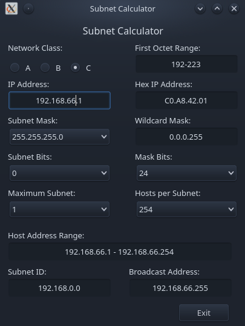

<h1 align="center">Subnet Hesaplayici (ENG)</h1>

<div align="center">
  <strong>PyQt5 ile hazirlanmis Subnet Hesaplayici</strong>
</div>

<br />

<div align="center">
  
  <a href="https://github.com/Saizzou/SubnetCalculator/graphs/contributors"></a>
  
  
</div>

<br />

# Bilgiler
Python ile hazirlanmis Subnet Hesaplayicisi. Arayüz Proje icerisinde mevcuttur. Baska bir Proje icin hazirlanmis ara parcadir.

## Temel Gereksinimler:

1- Python!

2- PyQt5


### Projeyi calistirma ve inceleme:

Projeyi calistirmak icin :
``` python SubnetCalculator.py```


### PR:
Bug yada hata bulmaniz durumunda PR kabul edilir. Simdiden tesekkür ederim :)
